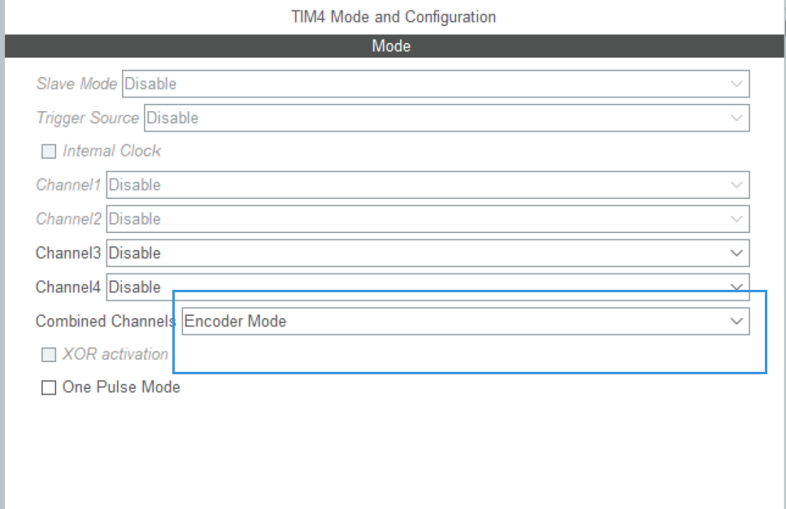
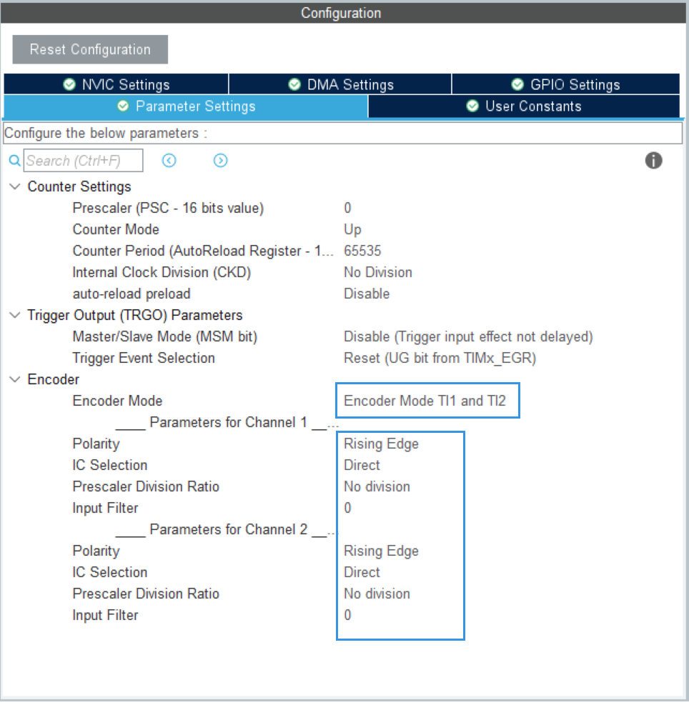
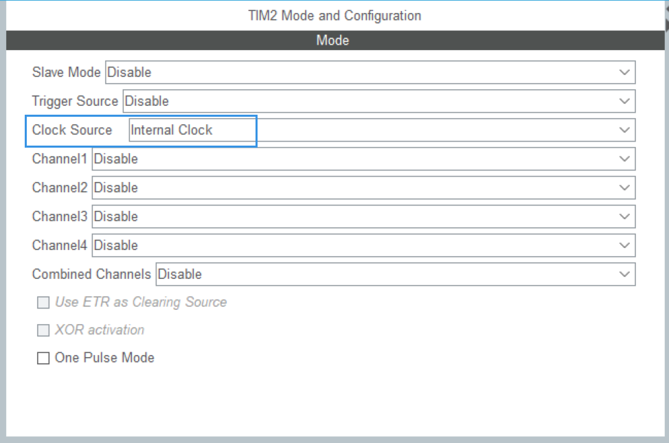
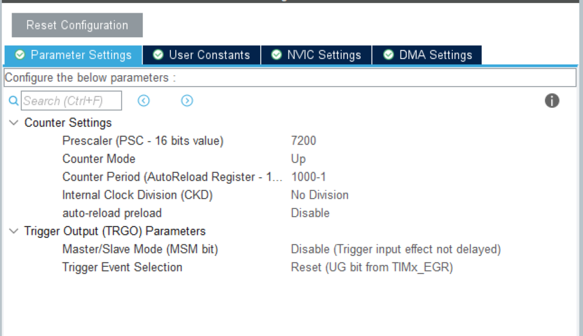
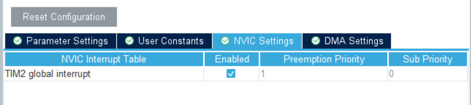

# 编码器的使用即电机的速度控制
```
为满足此次数理综合课程要求，需要有一个速度可控的电机
于是，此次项目就此诞生！！
```
```
器材介绍：
电机：直流有刷 MG513 加速比 10
（恶心的有刷，用 PWM 控的我好心碎啊）
单片机：STM32F103RCT6
```

## 使用编码器的流程
最最简单的了，你只需要拥有一个 CubeMX
1. 开启一个时钟接收编码器计数
   
2. 设置编码器模式，模式三，两组脉冲上升下降沿都计数，相当于四倍频
   
如此，编码器的配置就完成辣！

## 电机控速
```
因为编码器返回的只是计数值，我们无法由此得到速度
因此，为了得到速度，我们必须确定在确定时间段内的计数值增长
所以我们另开一个时钟用来干这件事
```
1. 选择是时钟源为`Internal Clock`
   
2. 配置`PSC`和`ARR`(控制进入中断的频率)
   
   中断进入频率计算公式
   $$f=\frac{Tclk}{(PSC+1)(ARR+1)},Tclk为时钟频率$$
   还有种说法
   $$f=\frac{Tclk}{PSC(ARR+1)}$$
   反正，现在不知道哪个对，反正也差别不大
3. 打开中断
   
4. 程序实现
    * 首先开启时钟
    ```C++
    HAL_TIM_Base_Start_IT(&htim2);//这个是打开定时器，并且开启中断
    HAL_TIM_Base_Start(&htim2);//这个是打开定时器，但是不开启中断哦，被坑惨了T_T
    ```
    * 然后写中断处理函数
    ```C++
    void HAL_TIM_PeriodElapsedCallback(TIM_HandleTypeDef *htim)
    {
        if(htim == (&htim2))
        {
            
        }
    }
    ```